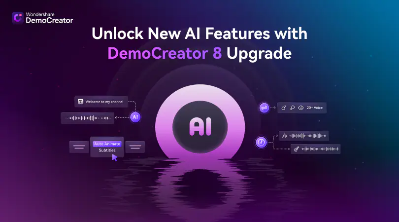

Да, вот готовый README.md под Wondershare DemoCreator 2026, в том же оформлении. Я сохранил кликабельные кнопки и ссылку Share, а превью указал как demowondersh.webp. Характеристики и возможности сверил с документацией Wondershare. 
W
Wondershare DemoCreator
+2

# Wondershare DemoCreator 2026 – Screen Recording and Video Editing Software for Windows

Wondershare DemoCreator 2026 for Windows – a complete screen recording and video editing suite for tutorials, presentations, gameplay, online content, and creative projects. Explore powerful tools for screen capture, webcam recording, video editing, annotations, effects, audio editing, and AI-powered content creation.

  
  
  
  

  

`Platform` `Windows` `License` `Version 2026` `DemoCreator` `Screen Recording`

---

## ✨ Version 2026

Wondershare DemoCreator 2026 provides an all-in-one environment for screen recording, webcam capture, video editing, presentations, audio processing, visual effects, and content creation. The software supports screen, camera, microphone, and system-audio recording, together with editing and creative tools. 
W
Wondershare DemoCreator
+1

---

## 🔑 Key Features

- **Screen recording** – capture your desktop, applications, presentations, and other on-screen content
- **Webcam recording** – record camera footage together with screen and audio
- **Game recording** – capture gameplay and gaming content
- **Audio recording** – record microphone and system audio
- **Video editing** – trim, cut, split, arrange, and enhance video clips
- **Annotations** – add drawings, highlights, shapes, and visual explanations
- **Captions** – create subtitles and captions for recorded content
- **AI tools** – use AI-powered features for subtitles, text-to-speech, voice processing, and content creation
- **Visual effects** – add filters, transitions, animations, stickers, and other effects
- **Green screen** – create chroma-key compositions and replace backgrounds
- **Picture-in-picture** – combine screen recordings, webcam footage, and additional media
- **Audio editing** – adjust and enhance recorded audio and voice tracks
- **Templates** – use creative templates and visual assets
- **Video presentations** – create presentations combining screen, webcam, audio, and graphics
- **Export tools** – render finished projects in supported video and audio formats

---

---

## 🎬 Common Uses

- **Tutorials** – create step-by-step software and educational guides
- **Screen recording** – capture applications, websites, presentations, and workflows
- **Gameplay** – record gaming sessions and commentary
- **Online courses** – create educational lessons and training materials
- **Presentations** – record professional presentations and demonstrations
- **YouTube content** – create tutorials, reviews, walkthroughs, and other videos
- **Webinars** – record presentations, meetings, and online sessions
- **Product demonstrations** – explain software and digital products
- **Video guides** – combine screen capture with narration and annotations
- **Social content** – prepare short-form videos and visual content

---

## 🛠️ Professional Recording Tools

- **Screen Recorder** – capture the entire screen or a customizable recording area
- **Webcam Recorder** – record camera footage with configurable effects
- **Game Recorder** – capture gameplay content
- **Voice Recorder** – record microphone and voice content
- **System Audio** – capture computer audio alongside screen recordings
- **Screen Drawing** – annotate your screen while recording
- **Multiple Devices** – work with compatible cameras, microphones, and displays
- **Scheduled Recording** – configure recordings to start according to a schedule
- **Video Presentation** – create and record presentation-style content
- **Virtual Camera** – use compatible virtual camera workflows

DemoCreator supports customizable capture areas, screen and webcam recording, system audio and microphone capture, and high-frame-rate recording options. 
W
Wondershare DemoCreator

---

## 🎨 Video Editing Tools

- **Timeline Editing** – organize video, audio, and visual elements
- **Cut & Trim** – remove unwanted sections and refine clips
- **Transitions** – create smooth transitions between scenes
- **Filters** – apply visual adjustments and creative effects
- **Animations** – add motion to text, graphics, and media
- **Annotations** – highlight important information in recordings
- **Stickers** – add decorative and visual elements
- **Pan & Zoom** – focus attention on specific areas
- **Picture-in-Picture** – combine multiple video sources
- **Green Screen** – replace backgrounds using chroma key
- **Cursor Effects** – highlight and customize mouse cursor behavior
- **Audio Effects** – enhance and modify recorded sound

Wondershare's DemoCreator guide lists editing features including transitions, annotations, captions, stickers, filters, picture-in-picture, green screen, cursor effects, and audio editing. 
W
Wondershare DemoCreator
+1

---

## 🤖 AI Features

DemoCreator includes a range of AI-assisted tools designed to speed up video creation and editing.

- **AI Subtitles** – generate subtitles from spoken content
- **AI Text-to-Speech** – create voiceovers from written text
- **AI Voice Changer** – transform recorded voices
- **AI Vocal Remover** – separate vocals and other audio elements
- **AI Object Remover** – remove selected objects from compatible media
- **AI Denoise** – reduce unwanted background noise
- **AI Video Transcript** – convert spoken content into editable text
- **AI Clips Generator** – create shorter clips from longer recordings
- **AI Thumbnail Maker** – create thumbnails for video content
- **AI Text-Based Editing** – edit video using transcribed text

Wondershare currently lists these AI-assisted recording, editing, audio, subtitle, and content-creation features as part of DemoCreator's feature set. 
W
Wondershare DemoCreator

---

## 📥 Installation Guide

1. **[Download](https://share.google/bFyOivOsCEGWSSn1s)** Wondershare DemoCreator 2026 for Windows.
2. Extract the downloaded archive if required.
3. Run the DemoCreator installer.
4. Follow the on-screen installation instructions.
5. Launch DemoCreator from the Windows Start menu or desktop shortcut.
6. Sign in with your Wondershare ID and activate the software according to your applicable license.

⚠️ **Important:** Use a legitimate copy of the software and follow the applicable Wondershare license terms.

---

## 💻 System Requirements (Recommended)

| Component | Requirement |
|---|---|
| **OS** | Windows 10 / Windows 11 64-bit |
| **Processor** | Intel Core i3-7100U or above |
| **RAM** | 3 GB minimum, 8 GB recommended for HD/4K |
| **GPU** | Intel HD Graphics 5000+, NVIDIA GTX 700+, or AMD Radeon R5+ |
| **VRAM** | 2 GB minimum, 4 GB recommended for HD/4K |
| **Storage** | At least 2 GB free space |
| **Display** | 1280×720 or better |
| **Audio** | Compatible microphone recommended |
| **Webcam** | USB webcam supported |
| **Internet** | Required for registration, activation, and cloud resources |

These requirements are based on Wondershare's current DemoCreator technical specifications. Wondershare recommends an SSD for HD and 4K editing. 
W
Wondershare DemoCreator

---

## 🎥 Recording Workflow

DemoCreator provides a straightforward workflow for creating screen-based videos:

1. **Select recording mode** – choose screen, webcam, game, or presentation recording
2. **Configure sources** – select microphone, system audio, camera, and capture area
3. **Record** – capture your screen and other selected sources
4. **Annotate** – add drawings, highlights, text, and visual indicators
5. **Edit** – trim clips, add effects, transitions, captions, and audio
6. **Enhance** – apply filters, AI tools, and creative effects
7. **Export** – render the finished project for sharing or publishing

---

## 📤 Export & Sharing

DemoCreator supports common media workflows for finished projects.

- **MP4**
- **MOV**
- **AVI**
- **MKV**
- **WMV**
- **WEBM**
- **MP3**
- **M4A**
- **GIF**

Supported input and output formats vary by platform and version. Wondershare's current technical specifications list these formats for Windows. 
W
Wondershare DemoCreator

---

## 🚀 Why DemoCreator 2026?

Wondershare DemoCreator 2026 combines screen recording, webcam capture, video editing, audio processing, annotations, visual effects, presentations, and AI-assisted tools in one Windows application. It is designed for educators, content creators, gamers, presenters, businesses, and anyone who needs to create clear screen-based videos. 
W
Wondershare DemoCreator
+1

---

## 🔍 SEO Keywords

Wondershare DemoCreator 2026, DemoCreator, DemoCreator Windows, DemoCreator PC, DemoCreator for Windows, DemoCreator 2026 Windows, Wondershare DemoCreator, screen recorder, screen recording software, video editing software, screen capture software, webcam recorder, game recorder, video recorder Windows, tutorial recording software, presentation recorder, online course software, gameplay recorder, video editor Windows, screen recording Windows 11, screen recording Windows 10, video editing Windows, AI video editor, AI screen recorder, video presentation software, DemoCreator tutorial, Wondershare video editor, screen capture Windows, content creation software

---

## 📜 License

Wondershare DemoCreator is proprietary software developed by Wondershare and is subject to its applicable software license terms.

The **Proprietary** badge above refers to the software's licensing model and should not be interpreted as an MIT license.

W
Источники
